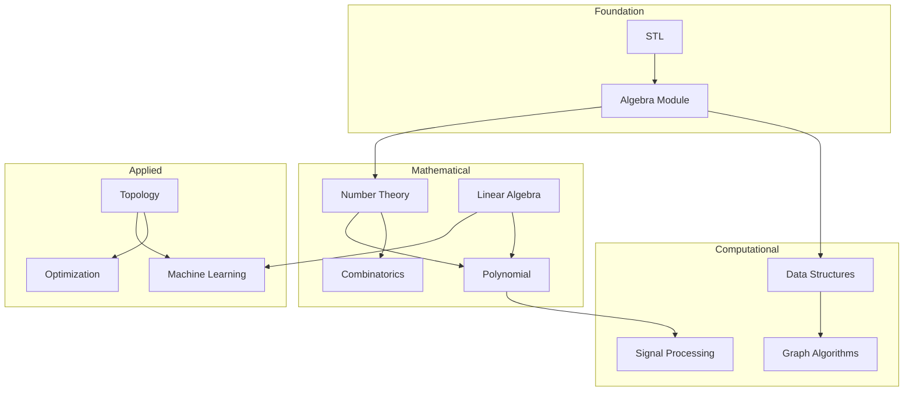

# CPLibrary Architecture

This document explains the design decisions, architectural patterns, and organizational principles behind CPLibrary.

## Table of Contents

- [Design Philosophy](#design-philosophy)
- [Architectural Overview](#architectural-overview)
- [Module Organization](#module-organization)
- [Design Patterns](#design-patterns)
- [Type System](#type-system)
- [Performance Considerations](#performance-considerations)
- [Dependencies](#dependencies)
- [Future Directions](#future-directions)

## Design Philosophy

### Core Principles

CPLibrary is built on four fundamental principles:

#### 1. Mathematical Rigor

Every algorithm and data structure in this library is based on solid mathematical foundations:

- **Formal Definitions**: Data structures are defined using proper algebraic structures (monoids, groups, rings, fields)
- **Correctness Proofs**: Implementations follow proven algorithms with known correctness properties
- **Complexity Guarantees**: Time and space complexity are mathematically analyzed and documented

**Example**: Segment trees are defined over associative binary operations, ensuring correct composition of query results.

#### 2. Zero-Overhead Abstractions

Following C++'s principle of "you don't pay for what you don't use":

- **Template-Based**: Generic programming allows type flexibility without runtime cost
- **Compile-Time Optimization**: Static polymorphism via templates and constexpr
- **Inline Functions**: Small operations are inlined by the compiler
- **No Virtual Functions**: Avoid vtable overhead unless absolutely necessary

**Example**: Static vectors (`s_vector<T, N>`) have compile-time size, enabling complete optimization.

#### 3. Generic Programming

Code should work with as many types as possible:

- **Type-Agnostic**: Algorithms work with any type satisfying requirements
- **Concept-Based**: Use C++20 concepts to constrain templates
- **Policy-Based Design**: Allow customization of behavior through policies

**Example**: Segment trees work with any associative operation, not just addition or minimum.

#### 4. Readability and Maintainability

Code should be understandable:

- **Clear Naming**: Descriptive names following mathematical conventions
- **Documentation**: Comprehensive comments explaining mathematical concepts
- **Examples**: Practical usage examples for each major feature
- **Modular Structure**: Clean separation of concerns

## Architectural Overview

### High-Level Architecture

```
┌─────────────────────────────────────────────────────────────┐
│                     Application Layer                        │
│              (Competitive Programming Solutions)             │
└───────────────────────────┬─────────────────────────────────┘
                            │
                            │ Uses
                            ↓
┌─────────────────────────────────────────────────────────────┐
│                    CPLibrary Headers                         │
│                     (Header-Only)                            │
├─────────────────────────────────────────────────────────────┤
│  ┌────────────┐  ┌────────────┐  ┌────────────┐           │
│  │  Algebra   │  │   Data     │  │   Graph    │           │
│  │            │  │ Structures │  │            │           │
│  └─────┬──────┘  └──────┬─────┘  └──────┬─────┘           │
│        │                │                │                  │
│  ┌─────▼──────┐  ┌──────▼─────┐  ┌──────▼─────┐           │
│  │   Number   │  │   Linear   │  │ Polynomial │           │
│  │   Theory   │  │  Algebra   │  │            │           │
│  └────────────┘  └────────────┘  └────────────┘           │
└───────────────────────────┬─────────────────────────────────┘
                            │
                            │ Built with
                            ↓
┌─────────────────────────────────────────────────────────────┐
│                    C++ Standard Library                      │
│              (STL containers, algorithms, etc.)              │
└─────────────────────────────────────────────────────────────┘
```

### Layer Responsibilities

#### Application Layer
- Competitive programming solutions
- User code utilizing the library
- Problem-specific implementations

#### Library Layer
- Core algorithms and data structures
- Generic implementations
- Mathematical abstractions

#### Foundation Layer
- C++ Standard Library
- Boost (for testing and utilities)
- Compiler intrinsics (SSE3, etc.)

## Module Organization

### Module Hierarchy



### Module Dependencies

#### Foundation Modules

**Algebra** (`include/algebra/`)
- **Purpose**: Core algebraic structures and operations
- **Exports**: Binary operations, monoids, groups, rings, fields
- **Dependencies**: STL only
- **Key Files**:
  - `binary_operation.h` - Generic binary operations
  - `abstract_algebra.h` - Fast exponentiation, GCD, etc.
  - `order.h` - Order relations
  - `types.h` - Type definitions

**Arithmetic** (`include/arithmetic/`)
- **Purpose**: Extended arithmetic types
- **Exports**: Big integers, variable-length integers
- **Dependencies**: STL
- **Key Files**:
  - `bigint.h` - Arbitrary precision integers
  - `varint.h` - Variable-length integers
  - `fast_arithmetic.h` - Optimized operations

#### Mathematical Modules

**Number Theory** (`include/nt/`)
- **Purpose**: Number-theoretic algorithms
- **Exports**: Modular arithmetic, primes, factorization
- **Dependencies**: Algebra
- **Key Files**:
  - `modular_arithmetic.h` - Modular types and operations
  - `number_theory.h` - GCD, LCM, CRT
  - `primality.h` - Prime testing and factorization
  - `sieve.h` - Sieve of Eratosthenes

**Linear Algebra** (`include/linear_algebra/`)
- **Purpose**: Vector and matrix operations
- **Exports**: Vectors, matrices, linear systems
- **Dependencies**: Algebra
- **Key Files**:
  - `vector.h` - Dynamic and static vectors
  - `matrix.h` - Dynamic and static matrices
  - `decomposition.h` - Matrix decompositions
  - `views/` - Efficient matrix/vector views

**Polynomial** (`include/polynomial/`)
- **Purpose**: Polynomial operations
- **Exports**: Polynomial arithmetic, FFT multiplication
- **Dependencies**: Algebra, Number Theory, Linear Algebra
- **Key Files**:
  - `polynomial.h` - Polynomial class
  - `fft.h` - FFT-based multiplication
  - `formal_series.h` - Power series operations

**Combinatorics** (`include/combinatorics/`)
- **Purpose**: Combinatorial functions
- **Exports**: Binomial coefficients, Stirling numbers, partitions
- **Dependencies**: Number Theory
- **Key Files**:
  - `binomial.h` - Binomial coefficients
  - `factorial.h` - Factorial computations
  - `stirling.h` - Stirling numbers
  - `partitions.h` - Partition functions

#### Computational Modules

**Data Structures** (`include/data_structures/`)
- **Purpose**: Advanced data structures
- **Exports**: Segment trees, Fenwick trees, etc.
- **Dependencies**: Algebra
- **Subdirectories**:
  - `fixed/` - Fixed-size structures
  - `dynamic/` - Dynamic-size structures
  - `statistic_tree/` - Order statistic trees
- **Key Files**:
  - `segment_tree.h` - Segment tree implementations
  - `fenwick_tree.h` - Fenwick tree (BIT)
  - `range_queries.h` - Range query utilities
  - `b_tree.h` - B-tree implementation

**Graph** (`include/graph/`)
- **Purpose**: Graph algorithms
- **Exports**: Trees, HLD, Union-Find, 2-SAT
- **Dependencies**: Data Structures, Algebra
- **Subdirectories**:
  - `tree/` - Tree algorithms
  - `algorithms/` - General graph algorithms
- **Key Files**:
  - `tree/tree.h` - Tree structures
  - `tree/range_queries.h` - Heavy-Light Decomposition
  - `union_find.h` - Disjoint Set Union
  - `2sat.h` - 2-SAT solver

**Signal Processing** (`include/signals/`)
- **Purpose**: FFT and related transforms
- **Exports**: FFT, NTT, Hadamard transform
- **Dependencies**: Polynomial, Number Theory
- **Key Files**:
  - `fft.h` - Fast Fourier Transform
  - `ntt.h` - Number Theoretic Transform
  - `multi_fft.h` - Multidimensional FFT

#### Applied Modules

**Machine Learning** (`include/ml/`)
- **Purpose**: Basic ML algorithms
- **Exports**: Regression, classification
- **Dependencies**: Linear Algebra, Topology
- **Key Files**:
  - `ml.h` - ML algorithms (linear/logistic regression, KNN)

**Topology** (`include/topology/`)
- **Purpose**: Metrics, norms, optimization
- **Exports**: Distance metrics, optimization algorithms
- **Dependencies**: Linear Algebra
- **Key Files**:
  - `topology.h` - Metrics and norms
  - `optimisation.h` - Newton-Raphson, gradient descent
  - `simplex.h` - Simplex method

**Functional** (`include/functional/`)
- **Purpose**: Functional programming utilities
- **Exports**: Map, filter, reduce, zip
- **Dependencies**: STL
- **Key Files**:
  - `functional.h` - Functional operations
  - `zip.h` - Zip function for parallel iteration

## Design Patterns

### 1. Generic Binary Operation Pattern

**Problem**: Many data structures (segment tree, Fenwick tree) work with different operations.

**Solution**: Template parameter for binary operation.

```cpp
template<typename T, typename BinaryOp>
class segment_tree {
    BinaryOp op_;
public:
    segment_tree(size_t n, BinaryOp op) : op_(op) { }

    T query(size_t l, size_t r) const {
        // Use op_ for combining results
    }
};
```

**Benefits**:
- Works with any associative operation
- Zero runtime overhead (inline operator calls)
- Type-safe at compile time

### 2. Static vs Dynamic Duality

**Problem**: Fixed-size structures are faster; dynamic structures are more flexible.

**Solution**: Provide both static and dynamic variants.

```cpp
// Static: compile-time size
template<typename T, size_t N>
class s_vector { /* ... */ };

// Dynamic: runtime size
template<typename T>
class d_vector { /* ... */ };
```

**Benefits**:
- Static version: Complete optimization, no heap allocation
- Dynamic version: Flexible, easier to use
- Same interface for both

### 3. Policy-Based Design

**Problem**: Different allocation strategies, comparison methods, etc.

**Solution**: Template policies for customizable behavior.

```cpp
template<
    typename T,
    typename Allocator = std::allocator<T>,
    typename Compare = std::less<T>
>
class container : private Allocator, private Compare {
    // Implementation uses Allocator and Compare
};
```

**Benefits**:
- Customizable without inheritance
- Zero overhead from policies
- Compile-time composition

### 4. CRTP (Curiously Recurring Template Pattern)

**Problem**: Need static polymorphism without virtual function overhead.

**Solution**: CRTP for compile-time polymorphism.

```cpp
template<typename Derived>
class base {
public:
    void interface() {
        static_cast<Derived*>(this)->implementation();
    }
};

class derived : public base<derived> {
public:
    void implementation() { /* ... */ }
};
```

**Benefits**:
- No vtable overhead
- Compile-time method resolution
- Type-safe "virtual" methods

### 5. Expression Templates (Limited Use)

**Problem**: Matrix/vector operations create many temporaries.

**Solution**: Expression templates for lazy evaluation (used selectively).

```cpp
template<typename E>
class vector_expression {
    const E& expr;
public:
    auto operator[](size_t i) const { return expr[i]; }
};

// v1 + v2 returns expression, not evaluated until assignment
```

**Benefits**:
- Eliminate temporary objects
- Fuse multiple operations
- Better performance for chains of operations

**Note**: Used sparingly due to complexity; direct operations often sufficient.

### 6. Type Traits and Concepts

**Problem**: Ensure type requirements at compile time.

**Solution**: C++20 concepts and type traits.

```cpp
template<typename T>
concept Ring = requires(T a, T b) {
    { a + b } -> std::convertible_to<T>;
    { a - b } -> std::convertible_to<T>;
    { a * b } -> std::convertible_to<T>;
    { T(0) };
    { T(1) };
};

template<Ring T>
class polynomial { /* ... */ };
```

**Benefits**:
- Clear error messages
- Document requirements
- Catch errors at compile time

## Type System

### Algebraic Type Hierarchy

```
Type
├── Monoid (T, *, identity)
│   └── Group (+ inverse)
│       └── Abelian Group (commutative)
│           └── Ring (+ multiplication)
│               └── Commutative Ring
│                   ├── Integral Domain (no zero divisors)
│                   │   └── Field (+ multiplicative inverse)
│                   └── Euclidean Domain (+ division algorithm)
```

### Type Abstractions

#### Modular Arithmetic

```cpp
// Static modulus (compile-time)
template<integer Mod>
class modular {
    integer value_;
public:
    // Arithmetic operations modulo Mod
};

// Dynamic modulus (runtime)
class dynamic_modular {
    integer value_;
    static integer modulus_;
public:
    // Arithmetic operations modulo modulus_
};
```

**Design Decision**: Two variants for different use cases:
- Static: Faster, compile-time optimization
- Dynamic: Flexible, modulus can vary

#### Vectors and Matrices

```cpp
// Static: Stack-allocated, compile-time size
template<typename T, size_t N>
class s_vector {
    std::array<T, N> data_;
};

// Dynamic: Heap-allocated, runtime size
template<typename T>
class d_vector {
    std::vector<T> data_;
};
```

**Design Decision**: Trade-off between flexibility and performance.

### Type Requirements

#### Ring Requirements

For a type to be used as a ring element:

```cpp
// Required operations
T a, b;
T(0);        // Additive identity
T(1);        // Multiplicative identity
a + b;       // Addition
a - b;       // Subtraction
a * b;       // Multiplication
a += b;      // Compound assignment
a -= b;
a *= b;
```

#### Field Requirements

Additional requirement for fields:

```cpp
a / b;       // Division (b ≠ 0)
a.inverse(); // Multiplicative inverse
```

## Performance Considerations

### Memory Layout

#### Cache-Friendly Design

**Matrices**: Row-major order for cache locality
```cpp
// data[i][j] stored as data[i * cols + j]
// Sequential access of rows is cache-friendly
```

**Segment Trees**: Implicit array representation
```cpp
// Node i has children at 2i and 2i+1
// No pointer chasing, better cache performance
```

#### Memory Allocation

- **Static structures**: Stack allocation, no heap
- **Dynamic structures**: Heap allocation via allocators
- **Reuse**: Minimize allocations through reserve/resize

### Compile-Time Optimization

#### Template Specialization

```cpp
// General case
template<typename T>
T multiply(T a, T b) { return a * b; }

// Specialized for powers of 2
template<>
int multiply<int>(int a, int b) {
    // Potentially use bit shifts
}
```

#### Constexpr Functions

```cpp
constexpr size_t factorial(size_t n) {
    return n <= 1 ? 1 : n * factorial(n - 1);
}

// Computed at compile time
constexpr auto f10 = factorial(10);
```

#### Static Size Optimization

```cpp
template<size_t N>
void process(s_vector<int, N>& v) {
    // Compiler can unroll loops, optimize heavily
    for (size_t i = 0; i < N; i++) {
        // Process v[i]
    }
}
```

### Algorithm Complexity

All algorithms document their complexity:

| Operation | Complexity | Notes |
|-----------|------------|-------|
| Segment Tree Construction | O(n) | Linear time build |
| Segment Tree Query | O(log n) | Logarithmic query |
| FFT | O(n log n) | Fast polynomial multiplication |
| Matrix Multiplication | O(n³) | Standard algorithm |
| Sieve of Eratosthenes | O(n log log n) | Generate primes |
| Union-Find | O(α(n)) | Amortized, α is inverse Ackermann |

### SSE3 Optimizations

Enabled by default:
```cmake
set(CMAKE_CXX_FLAGS "${CMAKE_CXX_FLAGS} -msse3")
```

**Usage**: SIMD operations for vectorizable loops (compiler-dependent).

## Dependencies

### Mandatory Dependencies

#### C++ Standard Library
- **Version**: C++23
- **Usage**: Containers, algorithms, utilities
- **Rationale**: Modern C++ features (concepts, ranges, etc.)

#### Boost
- **Components**:
  - `boost_unit_test_framework` - Unit testing
  - `boost_iostreams` - I/O utilities
  - `boost_program_options` - Command-line parsing
- **Rationale**: Robust testing framework, utilities not in std

### Optional Dependencies

#### SSE3
- **Usage**: SIMD operations
- **Rationale**: Performance boost for numerical operations
- **Fallback**: Works without SSE3 (slower)

### Rationale for Minimal Dependencies

**Why header-only?**
- Easy integration (just include headers)
- No linking required
- Easier for competitive programming

**Why C++23?**
- Concepts for better error messages
- Ranges for cleaner code
- Modern features improve readability

**Why Boost only for testing?**
- Mature testing framework
- Not required for library usage
- Commonly available

## Future Directions

### Planned Enhancements

#### Short Term
- [ ] Complete string algorithms module
- [ ] Finish graph algorithms (shortest paths, flows)
- [ ] Add more ML algorithms (neural networks, SVM)
- [ ] Expand geometry module

#### Medium Term
- [ ] Parallel algorithms (threading, SIMD)
- [ ] GPU support for matrix operations
- [ ] Automatic differentiation
- [ ] More optimization algorithms

#### Long Term
- [ ] Complete formal verification module
- [ ] Advanced data structures (persistent, functional)
- [ ] Category theory abstractions
- [ ] Advanced computational geometry

### Design Evolution

#### Module Splitting
As modules grow, consider splitting into sub-modules:
- `linear_algebra/` → `linear_algebra/dense/`, `linear_algebra/sparse/`
- `graph/` → `graph/directed/`, `graph/undirected/`, `graph/flows/`

#### API Stability
- **Current**: Evolving API, breaking changes possible
- **Target**: Stable 1.0 release with versioning
- **Strategy**: Deprecation warnings before removal

#### Performance Improvements
- Profile-guided optimization
- Benchmark suite for regression testing
- Cache-aware algorithm variants

## Lessons Learned

### What Worked Well

1. **Template-based design** - Flexibility without runtime cost
2. **Mathematical foundations** - Correctness through formal methods
3. **Header-only** - Easy integration and use
4. **Modular organization** - Clear separation of concerns

### Challenges

1. **Compilation time** - Templates increase compile time
   - **Mitigation**: Extern templates, forward declarations
2. **Error messages** - Template errors can be cryptic
   - **Mitigation**: C++20 concepts improve this significantly
3. **Code bloat** - Template instantiation increases binary size
   - **Mitigation**: Use same types consistently, link-time optimization

### Best Practices Discovered

1. **Document complexity** - Always include time/space complexity
2. **Provide examples** - Each feature needs usage example
3. **Test thoroughly** - Unit tests catch regressions
4. **Use concepts** - Better errors and documentation
5. **Profile first** - Don't optimize without measuring

## Conclusion

CPLibrary's architecture balances mathematical rigor, performance, and usability. The design prioritizes:

- **Correctness**: Through mathematical foundations
- **Performance**: Through zero-overhead abstractions
- **Flexibility**: Through generic programming
- **Usability**: Through clear interfaces and documentation

The modular design allows independent use of components while maintaining clean dependencies. As the library evolves, these principles guide new additions and improvements.

---

**For questions or suggestions about the architecture, please open an issue or discussion on GitHub.**
