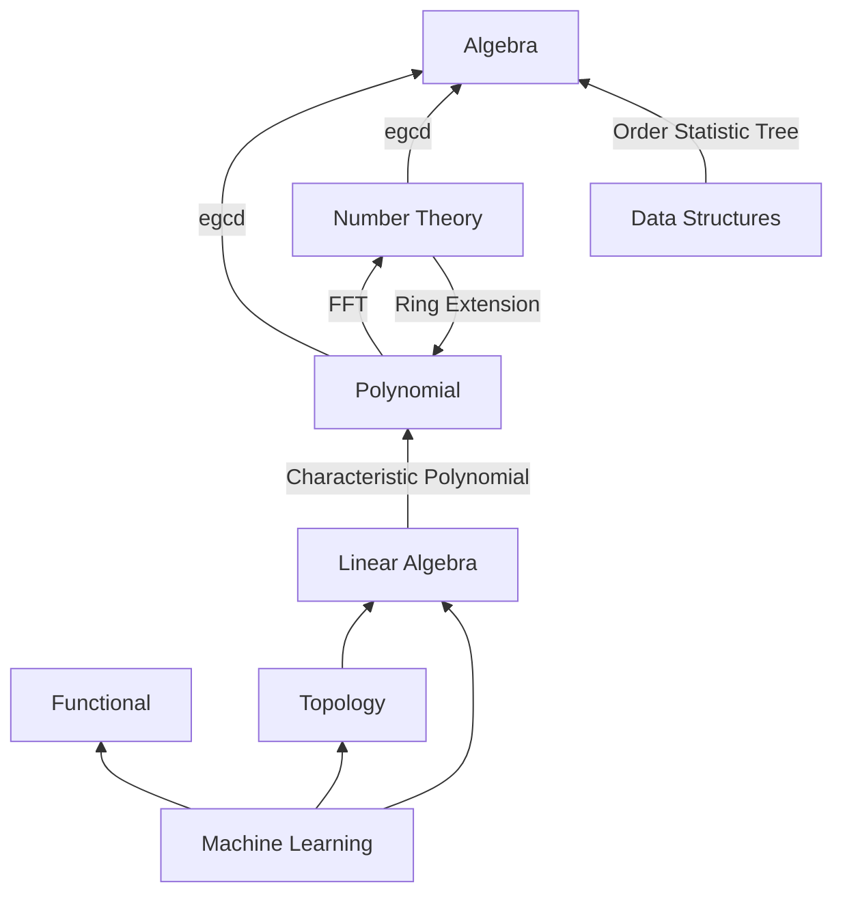

# CPLibrary - Competitive Programming & Mathematical Library

[](https://isocpp.org/)
[](https://cmake.org/)
[](LICENSE)

A comprehensive C++ library designed for competitive programming, featuring advanced algorithms and data structures with mathematical rigor. Built with emphasis on readability, zero-overhead abstractions, and correctness.

## 📚 Table of Contents

- [Overview](#overview)
- [Features](#features)
- [Requirements](#requirements)
- [Installation](#installation)
- [Quick Start](#quick-start)
- [Module Overview](#module-overview)
- [Usage Examples](#usage-examples)
- [Documentation](#documentation)
- [Testing](#testing)
- [Project Structure](#project-structure)
- [Contributing](#contributing)
- [Rationale](#rationale)

## 🎯 Overview

CPLibrary is a collection of non-trivial algorithms and data structures developed through extensive competitive programming experience. It incorporates knowledge from various mathematical fields including Linear Algebra, Abstract Algebra, Number Theory, Topology, and more to solve complex computational problems efficiently.

### Key Characteristics

- **Mathematical Rigor**: Implementations based on solid mathematical foundations
- **Zero-Overhead**: Template-based design with compile-time optimizations
- **Type-Safe**: Leverages C++23 features for type safety and expressiveness
- **Modular**: Well-organized modules with clear dependencies
- **Tested**: Comprehensive test suite using Boost.Test framework

## ✨ Features

### Core Competitive Programming Features

#### 1. **Data Structures**
- **Segment Tree** - Over associative binary operations
- **Fenwick Tree** - Over group operations
- **Sparse Table** - Over associative idempotent binary operations
- **Order Statistic Tree** - For order statistics queries
- **Statistic Trees** - With statistics acting on keys/values
- **B-Tree** - Efficient balanced tree with guaranteed O(log n) performance

#### 2. **Abstract Algebra**
- Generic binary operations (addition, multiplication, etc.)
- Fast exponentiation over monoids
- Extended Euclidean Algorithm and Bézout coefficients over integral domains
- Rational extension: field of rationals over integral domains
- Ring extensions (dynamic/static) of commutative rings
- Quadratic extensions of commutative rings
- Conjugate elements and consistent division
- Element inversion in ring extensions

#### 3. **Modular Arithmetic**
- Static and dynamic cyclic elements
- Primitive roots of unity
- Discrete logarithm
- Modular square root
- Legendre symbol
- Linear time inverse table: compute 1⁻¹, 2⁻¹, ..., n⁻¹ in O(n)

#### 4. **Linear Algebra**
- Dynamic and static vectors over commutative rings
- Dynamic and static matrices over commutative rings
- Matrix arithmetic operations
- Linear system solving over fields
- Matrix determinant calculation
- Characteristic polynomial computation

#### 5. **Polynomial Operations**
- Polynomial and sparse polynomial representations
- Polynomial arithmetic
- Subquadratic multiplication for commutative rings
- Newton interpolation
- Fast polynomial multiplication

#### 6. **FFT & Signal Processing**
- FFT over ℂ (complex numbers)
- FFT over 𝔽ₚ (finite fields)
- 2D FFT variants
- Fast Hadamard Transform
- Multidimensional FFT
- Number Theoretic Transform (NTT)

#### 7. **Number Theory**
- Prime number sieve in O(n ln n)
- Multiplicative functions
- Chinese Remainder Theorem
- Rabin-Miller primality test
- Pollard's Rho factorization algorithm
- Dirichlet convolution

#### 8. **Graph Algorithms**
- Tree structures and operations
- Heavy-Light Decomposition (HLD)
- Tree isomorphism
- Range queries on trees
- Union-Find (Disjoint Set Union)
- 2-SAT solver

#### 9. **Combinatorics**
- Binomial coefficients
- Factorial computations
- Stirling numbers
- Partition functions
- Ordinary Generating Functions (OGF)
- Exponential Generating Functions (EGF)

#### 10. **String Algorithms**
- Rabin-Karp probabilistic string matching

#### 11. **Optimization**
- Simplex method for linear programming

### Additional Mathematical Features

#### 12. **Analysis**
- Taylor series for exp, log over commutative rings
- exp, log over Banach algebras
- Newton-Raphson method over ℝ and ℂ vector spaces

#### 13. **Topology**
- Abstract metrics, norms, and inner products
- Common metric definitions (L1, L2, L∞, etc.)
- Multivariable function derivation between vector spaces

#### 14. **Functional Programming**
- Pointwise unary operators
- Pointwise binary operators
- foreach operations over iterables
- Pointwise reduce over associative operators
- Pointwise aggregate transformations
- zip function for simultaneous iteration

#### 15. **Machine Learning**
- Linear Regression
- Logistic Regression
- Multinomial Logistic Regression
- K-Nearest Neighbors Regression
- K-Nearest Neighbors Classification

#### 16. **Order Theory**
- Order closure of totally ordered sets
- Algebraic operations on order closures

#### 17. **Geometry**
- Point operations
- Geometric shapes
- Transformations
- Triangle operations

#### 18. **Parsing & Formal Verification**
- Grammar support
- LR/LL/SLR/LALR parser builders
- Decision trees
- Abstract decision trees

## 🔧 Requirements

### Mandatory
- **C++ Compiler**: C++23 compatible compiler (GCC 11+, Clang 14+, or MSVC 2022+)
- **CMake**: Version 3.11 or higher
- **Boost**: Required for unit testing and some utilities
  - `boost_unit_test_framework`
  - `boost_iostreams`
  - `boost_program_options`

### Optional
- **SSE3**: Enabled by default for performance optimizations
- **Python 3**: For running Python examples

### Operating System
- Linux (tested)
- macOS (should work)
- Windows (with appropriate compiler)

## 📦 Installation

### Clone the Repository

```bash
git clone <repository-url>
cd CPLibrary
```

### Install Dependencies

#### Ubuntu/Debian
```bash
sudo apt-get update
sudo apt-get install build-essential cmake libboost-all-dev
```

#### macOS (with Homebrew)
```bash
brew install cmake boost
```

#### Arch Linux
```bash
sudo pacman -S base-devel cmake boost
```

### Build the Project

```bash
# Create build directory
mkdir build
cd build

# Configure with CMake
cmake ..

# Build (use -j for parallel compilation)
cmake --build . -j$(nproc)

# Run tests
ctest --output-on-failure
```

### Alternative: Using CMake Presets

```bash
# Debug build
cmake --preset=debug
cmake --build --preset=debug

# Release build
cmake --preset=release
cmake --build --preset=release
```

## 🚀 Quick Start

### Basic Example: Using Modular Arithmetic

```cpp
#include "nt/modular_arithmetic.h"
#include <iostream>

int main() {
    // Define modular integers with modulus 1000000007
    using mint = cp::modular<1000000007>;

    mint a = 123456789;
    mint b = 987654321;

    mint c = a * b;
    std::cout << "Product: " << c << std::endl;

    // Fast exponentiation
    mint d = cp::pow(a, 1000000000);
    std::cout << "Power: " << d << std::endl;

    return 0;
}
```

### Example: Segment Tree for Range Queries

```cpp
#include "data_structures/range_queries.h"
#include <iostream>
#include <vector>

int main() {
    std::vector<int> data = {1, 3, 5, 7, 9, 11};

    // Create segment tree for range sum queries
    auto seg_tree = cp::make_segment_tree(data, std::plus<>());

    // Query sum from index 1 to 4
    int sum = seg_tree.query(1, 4);
    std::cout << "Sum [1, 4]: " << sum << std::endl;

    // Update element at index 2
    seg_tree.update(2, 10);

    return 0;
}
```

### Example: Matrix Operations

```cpp
#include "linear_algebra/matrix.h"
#include "linear_algebra/vector.h"
#include <iostream>

int main() {
    // Create a 3x3 matrix
    cp::d_matrix<double> A = {
        {1, 2, 3},
        {4, 5, 6},
        {7, 8, 9}
    };

    // Create a vector
    cp::d_vector<double> v = {1, 2, 3};

    // Matrix-vector multiplication
    auto result = A * v;

    // Calculate determinant
    double det = cp::determinant(A);
    std::cout << "Determinant: " << det << std::endl;

    return 0;
}
```

### Example: FFT for Polynomial Multiplication

```cpp
#include "polynomial/fft.h"
#include "polynomial/polynomial.h"
#include <iostream>

int main() {
    // Define two polynomials
    std::vector<double> p1 = {1, 2, 3};  // 1 + 2x + 3x²
    std::vector<double> p2 = {4, 5, 6};  // 4 + 5x + 6x²

    // Multiply using FFT
    auto product = cp::multiply_fft(p1, p2);

    // Print result
    for (auto coef : product) {
        std::cout << coef << " ";
    }
    std::cout << std::endl;

    return 0;
}
```

## 📖 Module Overview

The library is organized into interconnected modules:



### Module Descriptions

| Module | Description | Key Headers |
|--------|-------------|-------------|
| **Algebra** | Core algebraic structures and operations | `algebra/abstract_algebra.h`, `algebra/binary_operation.h` |
| **Arithmetic** | Big integers, variable-length integers | `arithmetic/bigint.h`, `arithmetic/varint.h` |
| **Combinatorics** | Binomial coefficients, factorials, generating functions | `combinatorics/binomial.h`, `combinatorics/factorial.h` |
| **Data Structures** | Segment trees, Fenwick trees, sparse tables | `data_structures/segment_tree.h`, `data_structures/fenwick_tree.h` |
| **Graph** | Graph algorithms and tree operations | `graph/tree/tree.h`, `graph/union_find.h` |
| **Linear Algebra** | Vectors, matrices, linear system solving | `linear_algebra/matrix.h`, `linear_algebra/vector.h` |
| **Number Theory** | Primes, modular arithmetic, factorization | `nt/modular_arithmetic.h`, `nt/number_theory.h` |
| **Polynomial** | Polynomial operations and FFT | `polynomial/polynomial.h`, `polynomial/fft.h` |
| **Topology** | Metrics, norms, optimization | `topology/topology.h`, `topology/simplex.h` |
| **ML** | Machine learning algorithms | `ml/ml.h` |

## 📝 Usage Examples

The `example/` directory contains various usage examples:

- **HLD.cpp** - Heavy-Light Decomposition implementation
- **PathQuery.cpp** - Path queries on trees
- **RangeQuery.cpp** - Range query examples
- **machine_learning.cpp** - ML classification on Iris dataset
- **expression.cpp** - Expression parsing
- **grammar.cpp** - Grammar parsing examples
- **nim.cpp** - Game theory (Nim game)
- **power_series_composition.cpp** - Power series operations

To run an example:

```bash
cd build
./HLD < ../example/in.txt
./MLExample  # Requires iris.data dataset
```

## 📚 Documentation

Detailed documentation is available in the `doc/` directory:

- **[Module Index](doc/index.md)** - Overview of all modules
- **[Algebra](doc/algebra/index.md)** - Abstract algebra documentation
- **[Linear Algebra](doc/linear_algebra/index.md)** - Vectors and matrices
- **[Number Theory](doc/nt/index.md)** - Modular arithmetic and number theory
- **[Functional](doc/functional/index.md)** - Functional programming utilities

### Building Documentation (if available)

```bash
# Using Doxygen (if configured)
doxygen Doxyfile
```

## 🧪 Testing

The library includes comprehensive tests using Boost.Test framework:

```bash
# Build and run all tests
cd build
ctest --output-on-failure

# Run specific test suites
./LinearAlgebraTest
./NumberTheoryTest
./PolynomialTest
./DataStructuresTest
./MachineLearningTest
./TopologyTest
./AlgebraTest
```

Test coverage includes:
- Linear algebra operations (exact and approximate)
- Modular arithmetic and number theory
- Polynomial operations
- Data structure correctness
- Machine learning algorithms
- Topology and optimization
- Abstract algebra

## 📁 Project Structure

```
CPLibrary/
├── CMakeLists.txt           # CMake build configuration
├── README.md                # This file
├── main.cpp                 # Main entry point
├── include/                 # Header-only library files
│   ├── algebra/            # Abstract algebra
│   ├── arithmetic/         # Big integers, variable integers
│   ├── combinatorics/      # Combinatorial functions
│   ├── data_structures/    # Trees, arrays, queries
│   ├── fields/             # Field theory
│   ├── formal_verification/ # Parsing and verification
│   ├── functional/         # Functional programming
│   ├── geometry/           # Geometric algorithms
│   ├── graph/              # Graph algorithms
│   ├── groups/             # Group theory
│   ├── linear_algebra/     # Matrices and vectors
│   ├── ml/                 # Machine learning
│   ├── nt/                 # Number theory
│   ├── parser/             # Parsing utilities
│   ├── polynomial/         # Polynomial operations
│   ├── rings/              # Ring theory
│   ├── signals/            # FFT and signal processing
│   ├── string/             # String algorithms
│   └── topology/           # Topology and optimization
├── src/                     # Implementation files (.cpp)
│   ├── arithmetic/
│   ├── formal_verification/
│   └── parser/
├── example/                 # Usage examples
├── tests/                   # Unit tests
├── doc/                     # Documentation
└── cmake-build-*/          # Build directories (generated)
```

## 🤝 Contributing

Contributions are welcome! This library represents a personal journey through competitive programming, but improvements and additions are appreciated.

### Guidelines

1. **Code Style**: Follow existing code style (C++23 features, template-based)
2. **Documentation**: Add documentation for new features
3. **Tests**: Include unit tests for new functionality
4. **Mathematical Rigor**: Ensure correctness and proper mathematical foundations
5. **Zero-Overhead**: Maintain performance through compile-time optimizations

### Submitting Changes

1. Fork the repository
2. Create a feature branch (`git checkout -b feature/amazing-feature`)
3. Commit your changes (`git commit -m 'Add amazing feature'`)
4. Push to the branch (`git push origin feature/amazing-feature`)
5. Open a Pull Request

## 💡 Rationale

During my competitive programming journey, I explored novel approaches to many interesting problems. This led me to learn numerous algorithms and data structures, incorporating knowledge from different mathematical fields (Linear Algebra, Abstract Algebra, Number Theory, Topology, etc.) to solve hard problems.

I decided to write this repository to:
- **Share Knowledge**: Share my wonderful journey with interested people
- **Document Learning**: Keep a record of acquired knowledge and techniques
- **Provide Quality**: Offer well-tested, mathematically rigorous implementations
- **Enable Reuse**: Help others solve similar problems efficiently

This library emphasizes:
- **Readability**: Clear, understandable code
- **Correctness**: Mathematical rigor and proper testing
- **Performance**: Zero-overhead abstractions and optimizations
- **Generality**: Template-based generic programming

## 🎓 Learning Resources

This library can serve as:
- Reference for competitive programming contests
- Study material for advanced algorithms and data structures
- Examples of C++23 template metaprogramming
- Practical applications of abstract mathematics

## 📄 License

Please check the repository for license information.

## 🙏 Acknowledgments

This library was built through experience in competitive programming and study of various mathematical and computer science topics. Special thanks to the competitive programming community for inspiration and challenges.

## 📞 Support & Contact

For questions, issues, or suggestions:
- Open an issue on the repository
- Check existing documentation in the `doc/` folder
- Review examples in the `example/` directory

---

**Note**: This is a continuous work in progress. Some modules are marked as "To Be Completed" or "To Be Done" and are under active development.

## 🗺️ Roadmap

Future improvements:
- [ ] Complete string algorithms module
- [ ] Complete graph algorithms module
- [ ] Complete fast polynomials module
- [ ] Add more machine learning algorithms
- [ ] Expand geometric algorithms
- [ ] Add more examples and tutorials
- [ ] Improve documentation coverage
- [ ] Add benchmarking suite

---

*Generated with care for the competitive programming community* 🚀
