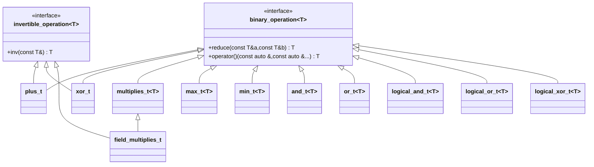

# Binary Operation

```c++
#include "algebra/binary_operation.h"
```



    ## 1. Classes 

This module defines the usual binary operations.

### a. `plus_t<T>`

This class defines addition:

- It's neutral element is `T{}`
- As a requirement `T` must be default constructible

### b. `multiplies_t<T>`

This class defines multiplication:

- It's neutral element is `T{1}`
- As a requirement `T` must be constructible from `int`

### c. `field_multiplies_t<T>`

This class defines addition:

- It's neutral element is `T{1}`
- As a requirement `T` must be constructible from `int`

### c. `max_t<T>`

This class defines maximum:

- It's neutral element is defined as `T{}`. **It may be needed to be changed on manually**
- As a requirement `T` must be constructible from `int` and `<` must define a strict total order on `T`

### d. `min_t<T>`

This class defines minimum:

- It's neutral element is defined as `T{}`. **It may be needed to be changed on manually**
- As a requirement `T` must be constructible from `int` and `<` must define a strict total order on `T`

### e. `gcd_t<T>`

This class defines greatest common divisor:

- It's neutral element is defined as `T{}`.
- As a requirement `T` must be constructible from `int` and `<` must define a strict total order on `T`

### f. `lcm_t<T>`

This class defines least common multiplier:

- It's neutral element is defined as `T{1}`.
- As a requirement `T` must be constructible from `int` and `<` must define a strict total order on `T`

### g. `and_t<T>`

This class defines bitwise and:

- It's neutral element is defined as `T{1}`.
- As a requirement `T` must be constructible from `int`

### h. `or_t<T>`

This class defines bitwise or:

- It's neutral element is defined as `T{1}`.
- As a requirement `T` must be constructible from `int`

### i. `xor_t<T>`

This class defines bitwise exclusive or:

- It's neutral element is defined as `T{1}`.
- As a requirement `T` must be constructible from `int`

### j. `logical_and_t<T>`

This class defines logical and:

- It's neutral element is defined as `T{true}`.
- As a requirement `T` must be constructible from `bool`

### k. `logical_or_t<T>`

This class defines logical or.

- It's neutral element is defined as `T{false}`.
- As a requirement `T` must be constructible from `bool`

### l. `logical_xor_t<T>`

This class defines logical exclusive or.

- It's neutral element is defined as `T{false}`.
- As a requirement `T` must be constructible from `bool`

## 2. Concepts

### a. Binary Operation

- A binary operation on a op `T` is a subclass of `binary_operation<T>` 

- Optionally, this class may need to have a public static attribute `neutral_element` denoting the neutral element of the operation

