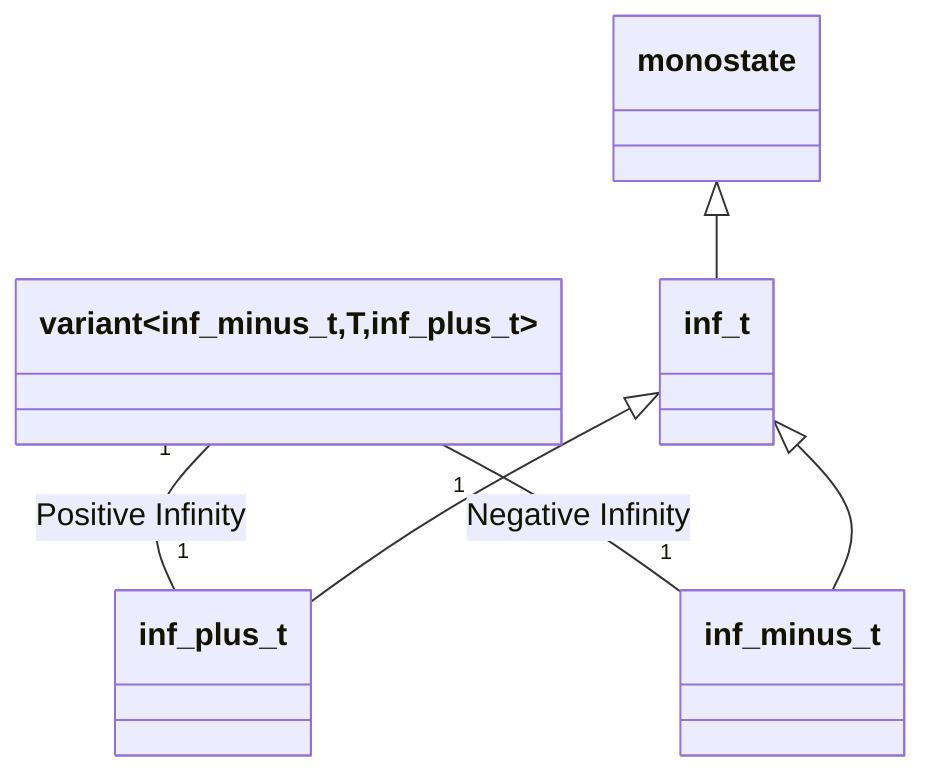

# Order

```c++
#include "algebra/order.h"
```





## 1. Classes

This module defines the following:

### a. `inf_t`

This is class defines a stateless object.

### b. `inf_plus_t & inf_minus_t` 

This two classes are both stateless.

They are defined such that any instance of `inf_minus_t` is always strictly less than any instance of `inf_plus_t`

## 2. Operations

## 3. Concepts

This module defines the following concepts