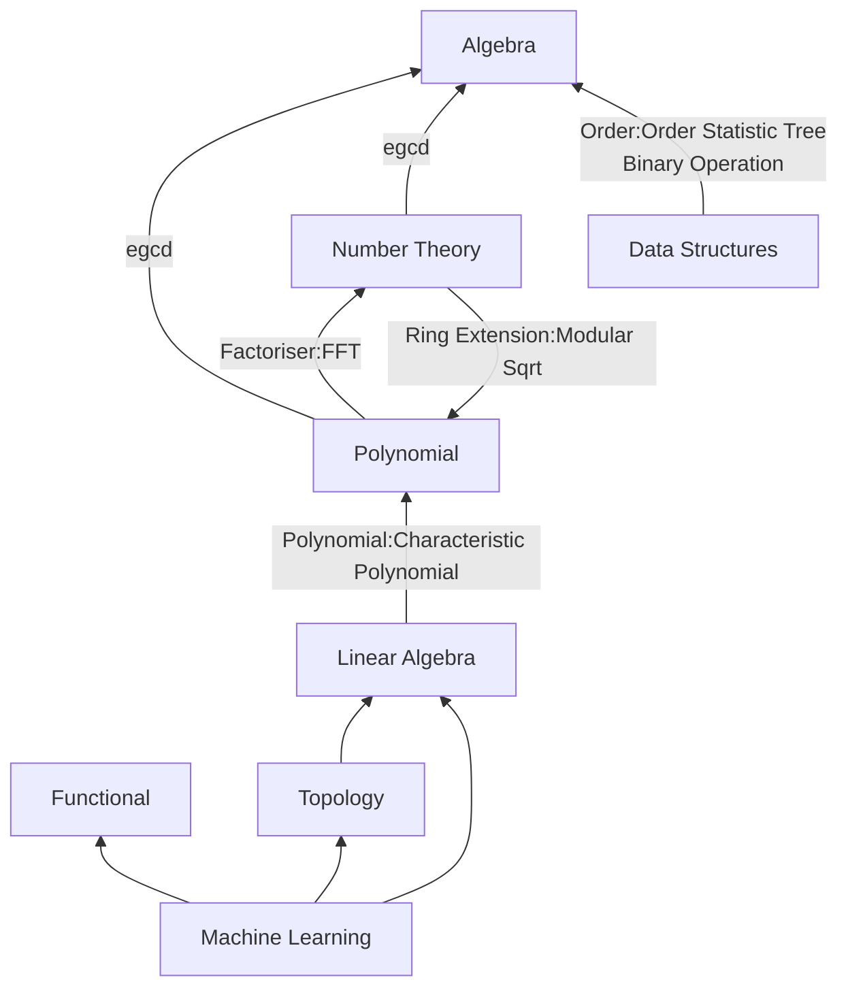

# CPLibrary

This Library is composents of many modules that interacts with each other:

- [Algebra module](algebra/index.md)
- [Linear Algebra module](linear_algebra/index.md)
- [Functional module](functional/index.md)
- [Machine Learning module]()
- [Number Theory module](nt/index.md)
- Polynomial module
- Topology module

