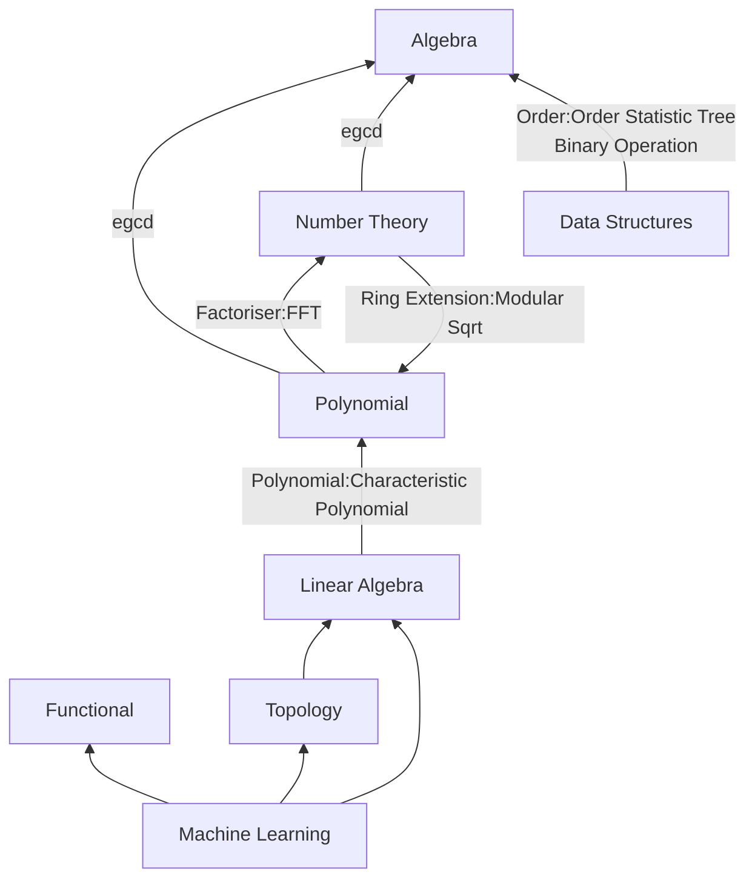
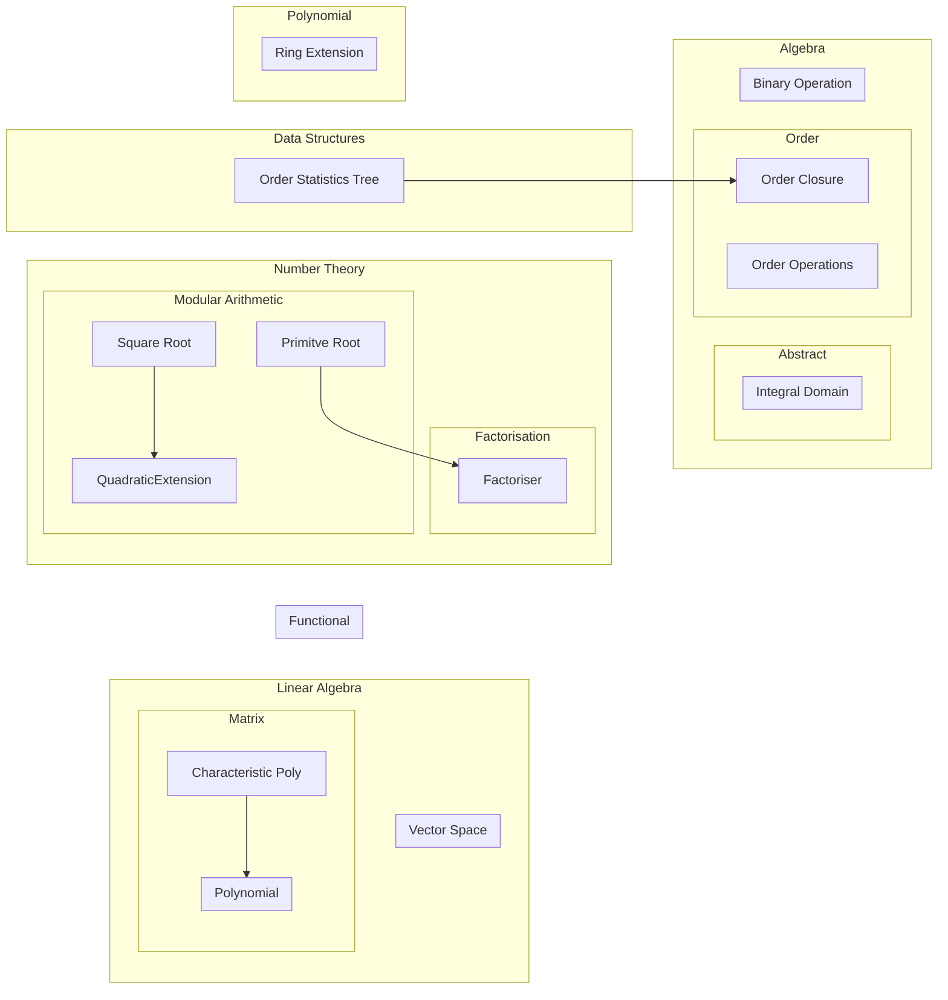

# CPLibrary

This Library is composents of many modules that interacts with each other:

- [Algebra module](linear_algebra/index.md)
- Linear Algebra module
- Functional module
- Machine Learning module
- Number Theory module
- Polynomial module
- Topology module

