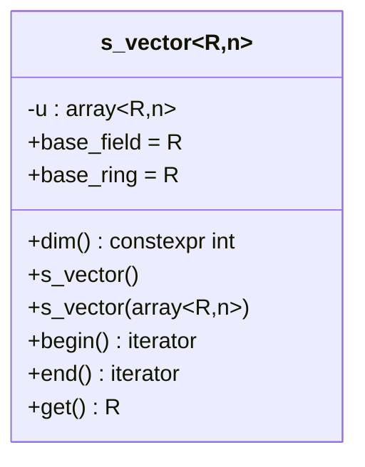

# Static Vector

```c++
#include "linear_algebra/linera_algebra.h"
```


```mermaid
classDiagram
	class s_vector~R,n~ {
	-u : array~R,n~
	+base_field = R
	+base_ring = R
	+dim() constexpr int
	+s_vector()
	+s_vector(array~R,n~)
	+begin() iterator
	+end() iterator
	+get() R
    
	}
```

This class