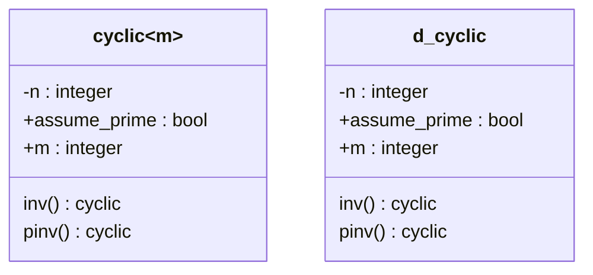

# Modular Arithmetic

```c++
#include "nt/modular_arithmetic.h"
```



Modular arithmetic is an important field of mathematics and computer science, which is well explained by ring theory.


In this module, we will define finite cyclic rings and give them the most important functions:

## 1. Classes

### a. `cyclic<n>`

This is a template class which perfectly defines $\mathcal{R}=\mathbb{Z}/n\mathbb{Z}.$ Its arithmetic is consistently defined as that of $\mathcal{R}.$ Also it defines:

- `inv` which gives the inverse
- `pinv` which gives the pseudo-inverse

- `assume_prime` is a boolean that tell whether to assume the ring as a field. If it is, setting it to `true` can result in a speed up on the calculation of the inverse

### b. `d_cyclic`

This is a  class which defines $S=\bigcup_{n\in\mathbb{N}^*}\mathbb{Z}/n\mathbb{Z}.$ As we are only interested in a particular $\mathbb{Z}/m\mathbb{Z}$ at a time, this class admits a public static attribute $m$ which defines the cyclic ring. Also:

- `inv` which gives the inverse
- `pinv` which gives the pseudo-inverse

- `assume_prime` is a boolean that tell whether to assume the ring as a field. If it is, setting it to `true` can result in a speed up on the calculation of the inverse

## 2. Concepts

This module defines the following concept:

- Cyclic Ring: denoted by `cyclic_ring`, which is any op that has addition and multiplication to be consistent with that of some cyclic ring $\mathbb{Z}/m\mathbb{Z}$ for some $m\in\mathbb{N}^*.$
- Cyclic Field: denoted by `cyclic_filed`, which is a Cyclic Ring with some prime module $p\in\mathbb{P}.$

## 2. Functions

#### a. `discrete_log(cyclic_ring x,cyclic_ring y)`

This function solves the equation:
$$
x^n=y
$$
For some $n\in\mathbb{N},$ with $x,y\in\mathbb{Z}/m\mathbb{Z}$ for some $m\in\mathbb{N}^*$ 

#### b. `primitive_root_of_unity(integer p,factoriser &F)`

This function find a primitive root of unity of $\mathbb{Z}/p\mathbb{Z}$ for a prime $p$ using the factoriser $F$

#### c. `legendre_symbol(cyclic_filed x)`

This function calculates the Legendre Symbol of some element $x\in\mathbb{Z}/p\mathbb{Z}$ defined as:
$$
x^{\frac{p-1}{2}}
$$

#### d. `sqrt(cyclic_field x)`

This function solves the equation over $\mathbb{Z}/p\mathbb{Z}$
$$
u²=x
$$